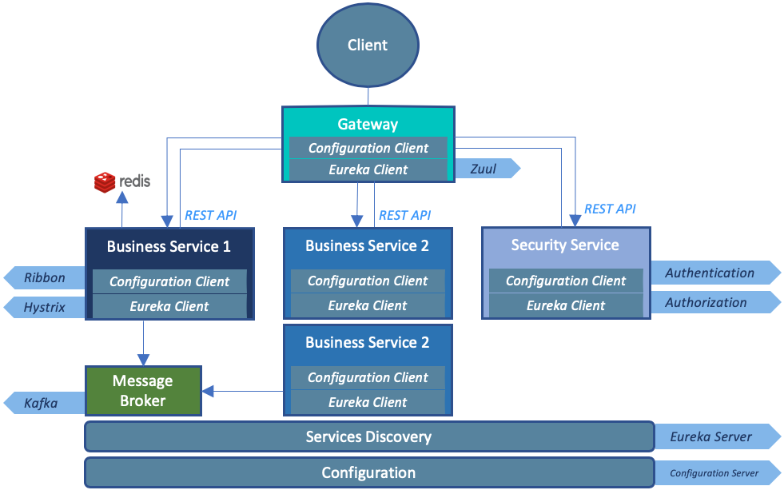

## Microservices Example Implementation v1.0

This project is implemented as the part of my Master Thesis topic on Microservices.<br><br>
Following are the services implemented through out my Master thesis. Each service is orchestrated, hence fulfills one of the recommended patterns in the microservices architecture.

##### What is implemented?



There are 2 business services i.e. Licensing (Business Service 1) and Organization (Business Service 2). Organization Service manages the organization data and their related functions. Licensing Service manages the licenses for the organizations. An organization can have multiple licenses.
To uses these services, their corresponding REST end-points are available (see below).

The other services are recommended patterns that orchestrate to compose the robust architecture for the 2 business services, like service registration, routing, security, resiliency, load balancing, log aggregation to name a few. Each service has it's respective REST end-point exposed for you to observe the architecture.

Discovery Service and Zipkin have UI based interface, accessible through browser. The rest of the services are REST based APIs.   
***
##### 1. Discovery Service
> No description available
##### 2. Configuration Server
> No description available
##### 3. Routing Service
> No description available
##### 4. Security Service
> No description available
##### 5. Organization Service
> No description available
##### 6. Licensing Service
> No description available
##### 7. PostgreSQL Database
> No description available
##### 8. Redis Server
> No description available
##### 9. Kafka + ZooKeeper
> No description available
##### 10. Zipkin
> No description available
***
##### Start Services 

Before starting the network on host, make sure that following ports are available and not occupied by any other process in order to run the services conveniently. However, you can change the ports by modifying the docker-compose.

| Service        | Port          | Reason |
| -------------  |:-------------:| :----- |
| Apache Kafka   | 9092          | A message broker, uses a default port |
| ZooKeeper      | 2181          | used by Apache Kafka |
| Redis          | 6379          | used by Licensing Service for caching |
| PostgreSQL     | 5432          | used by business services |
| Discovery Service     | 8761          | Other services register and find each other |
| Configuration Server     | 8888          | Some services bootstrap by configuration provided here |
| Security Service     | 8901          | Provides the Auth Tokens to interact with Business Services |
| Routing Service     | 5555          | A Gateway and Filter for other services. All requests goes through here |
| Zipkin     | 9411          | UI to display a transaction which propagates to downstream services |
| Organization Service     | 8091          | Manages data related to organizations |
| Organization Service (2) | 8092          | 2nd instance of Organization to display Load Balancing |
| Licensing Service     | 8081          | Manages data related to licenses |


##### Start the Services

```docker-compose -f docker/dev/docker-compose.yml up```

##### OAuth Tokens:
1. First generate the token
    - Token is used by only business services (Organization, Licensing)
    - A token can have 1 of the 2 roles, user or admin.
    - Credentials for both roles are already provided (see Security Service below)
    - User role can use GET 
    - Admin can use GET, PUT, POST, DELETE requests
2. Provide the token to HTTP request in order to access business services.
    - Licensing Service
    - Organization Service

NOTE: Tokens are not required for other services.

##### Services accessible from Browser:
- [Discovery Service](http://localhost:8761)
    - Instance(s) of other services are registered.
- [Zipkin](http://localhost:9411)
    - A GUI based tool to display the flow of a transaction.

##### Services accessible from REST APIs:
- [Security Service](https://documenter.getpostman.com/view/3326987/S11RKFeB)
    - Provides OAuth token
- [Licensing Service](https://documenter.getpostman.com/view/3326987/S11LtJPo)
- [Organization Service](https://documenter.getpostman.com/view/3326987/S11NMcBM)
- [Configuration Server](https://documenter.getpostman.com/view/3326987/S11LtJPj)
    - Services configuration for other services
- [Routing Service](https://documenter.getpostman.com/view/3326987/S11RKFeB)
    - A Gateway service
